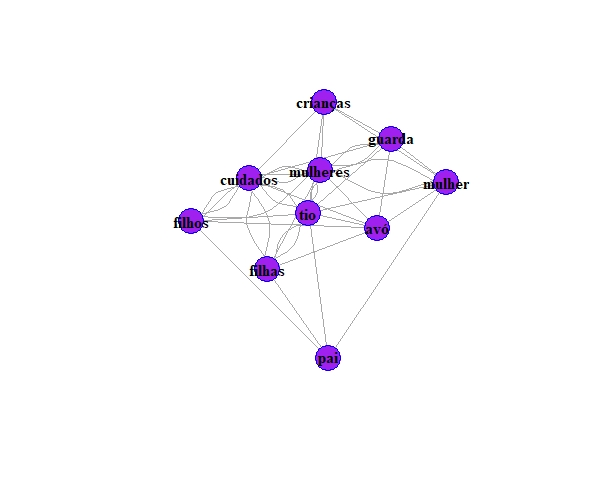

# Mineração de texto sobre decisões judiciais

# Resumo 

Esta análise de mineração de decisões judiciais faz parte de um projeto de pesquisa, do qual participo atualmente (2022), desenvolvido na FGV-RJ. Este projeto tem por objetivo analisar como o Marco Legal da Primeira Infância, Lei nº13.257/2016, foi incorporado nas decisões judiciais. Os resultados mais amplos da pesquisa, embora ainda parciais, pois a pesquisa permanece ainda em desenvolvimento, podem ser acessados neste <a href="https://bibliotecadigital.fgv.br/dspace/handle/10438/31963" title="FGV"> link</a>. Uma das ênfases desta pesquisa refere-se à aplicação do HC nº 143.641, que prevê a substituição de prisão preventiva por prisão domiciliar a possibilidade de substituição da prisão preventiva pela domiciliar para gestante, mulher com filho de até 12 (doze) anos de idade incompletos e homem, caso seja o único responsável.

Este HC relaciona-se à constatação de que o encarceramento das mães com crianças nessa fase tinha um efeito colateral sobre o desenvolvimento destas crianças. Afinal de contas, há evidências robustas de que a primeira infância constitui uma fase crucial de desenvolvimento cognitivo; mais do que isso, o desenvolvimento educacional nessa fase é um forte preditor de prosperidade profissional e da renda que a criança terá no futuro.   

A análise desenvolvida aqui é exploratória e deriva da mineração de decisões extraídas dos seguintes tribunais: 

> Supremo Tribunal Federal (STF), Superior Tribunal de Justiça (STJ) e Tribunal de Justiça do Rio de Janeiro (TJRJ). Outros tribunais foram acessados via parceria com a lawtech JUIT29: Tribunal de Justiça do Acre (TJAC), Tribunal de Justiça de Alagoas (TJAL), Tribunal de Justiça do Amazonas (TJAM), Tribunal de Justiça do Ceará (TJCE), Tribunal de Justiça do Mato Grosso do Sul (TJMS), Tribunal de Justiça de São Paulo (TJSP), Tribunal Regional Federal da 1ª Região (TRF1), Tribunal Regional Federal da 2ª Região (TRF2), Tribunal Regional Federal da 3ª Região (TRF3) e Tribunal Regional Federal da 5ª Região (TRF5).

No entanto, não lidei com todo o banco de dados analisado na pesquisa. 

# Tratamento dos dados 

A mineração de textos envolve um longo processo de limpeza dos dados não estruturados. 

Para isso, utilizei os pacotes `tm` e `NPL` no R para:

* Tokenização 
* *Stopwords* - extração de palavras indejesadas e sem semântica, como artigos e preposições.
* Extração de espaços.
* Extração de números.
* Padronização das palavras para letra mínuscula (para captar melhor a frequência das palavras).
* Algumas extrações manuais de jargões jurídicos como o número dos parágrafos, incisos etc.

# Análise de frequência de palavras

A análise de frequência de palavras pode ser visualizada por meio da nuvem de palavras, a partir do pacote `wordcloud`. A nuvem de palavras demonstra acima de tudo que o principal crime julgado nas decisões é o tráfico de drogas. Este achado toca em toda uma discussão maior sobre qual seria a abordagem mais adequada para a questão da comercialização e uso de psicotrópicos em nossa sociedade. Fato é que a condenação por tráfico é a principal causa de encarceramento no Brasil e se reflete também no julgamento de mães com filhos na fase de primeira infância, uma vez que o encarceramento desencadeia um efeito danoso sobre o desenvolvimento das crianças nesta fase.

A nuvem de palavras demonstra também alta frequência do termo *domiciliar*, o que sugere um possível impacto da MLPI na substituição da pena preventiva pela domiciliar. Esta hipótese é mais explorada na pesquisa.

# Papéis de gênero sobre o cuidado. 

Nessa parte, eu busquei demonstrar como a análise das decisões reflete os papéis sociais de gênero na função do cuidado. Isto é, como há uma maior associação entre figuras familiares femininas como (mulher, mulheres, tia, avó) com palavras como "guarda", "cuidado", "filhos" e "filhas" do que com figuras masculinas como "pai" e "tio". 

A análise de redes demonstra como as palavras "cuidado" e "guarda" estão correlacionadas com uma rede de figuras femininas, sobretudo a avó, ao passo que o termo "pai" está completamente isolado desta rede.

Isso reflete uma realidade brasileira, na qual os homens com frequência abandonam e não se encarregem da função do cuidado. Ao mesmo tempo, esta análise demonstra que as decisões judiciais provalvemente reforçam tais papéis. A alta associação entre guarda e avó sugere que, com frequência, em caso de prisão preventiva, a guarda é transferida para a avó.

